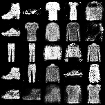

# Tổng quan

- Đây là bài tập lớn cho phần GANs, chạy trên google colab (môi trường cài đặt dễ dàng, có GPU miễn phí để sử dụng)
- Pipeline:
  
  - Nhiễu => Generator => ảnh giả => Discriminator => loss => backpropagation

# Dữ liệu và framework

- Bộ MNIST (số viết tay) 
- Pytorch

# Các phần chính

- Khởi tạo các tham số (hyperparameter): learning rate, số lượng epoch, batch_size,...
- Khởi tạo model cho 2 phần Generator và Discriminator
- Đọc dữ liệu từ bộ MNIST, chuẩn hóa, resize
- Huấn luyện (training)

# Quá trình cài đặt
**1. Generator**

- Mạng generator được cài đặt để sinh ra phân bố giống với phân bố của dữ liệu training
- Sử dụng các lớp fully_connected để biến đổi.
- Activation: LeakyRelu
- Có sử dụng batch normalize
- Vector đầu ra là vector số chiều bằng số chiều làm phẳng kích thước ảnh training (28x28 = 784)
- Sau đó biến đổi thành ảnh (28x28)

**2. Discriminator**

- Đầu vào là ảnh được sinh ra hoặc ảnh từ dữ liệu training được làm phẳng (flatten), đầu ra là xác xuất ảnh đấy là thật hay giả
- Qua các lớp fully_connected
- Activation: Leakyrelu
- Tại layer cuối sử dụng sigmoid activation để đầu ra là xác xuất từ (0 - 1)

**3. Training**

- Loss: binary cross entropy loss: bởi vì discriminator là binary classifiation
- Đọc dữ liệu theo từng batch_size
- Tạo nhãn và nhiễu ngẫu nhiên cho đầu vào của Generator 
- Từ nhiễu đó cho qua generator => ảnh giả
- Ảnh giả đưa vào model Discriminator => xác xuất => tính g_loss (loss của Generator)
- Loss của Discriminator được tính theo:
  - Ảnh thật qua Discriminator => xác xuất => real_loss
  - Ảnh giả qua Discriminator => xác xuất => fake_loss
  - d_loss = (real_loss + fake_loss) / 2 (trung bình)
  - Bởi vì Discriminator cần phát triển cả khả năng nhận diện ảnh thật và khả năng loại bỏ ảnh giả nên cần cả 2 loss

- Sau khi có g_loss và d_loss ta backpropagation, cứ thế đến hết số lượng epoch

**4. Biểu đồ loss:**

- Sử dụng tensorboard để lưu lại và biểu diễn

**5. Sử dụng model đã train được để sinh ngẫu nhiên ảnh giả:**

- Load weight model generator vào kiến trúc đã xây dựng ở trên.
- Sinh vector nhiễu ngẫu nhiên => qua model => ảnh

# Kết quả

**1. Loss MNIST**
- 
- Từ hình ảnh ta có thể thấy trong khoảng epoch thứ 30 thì loss của generator là thấp nhất => ta có thể sử dụng model tại đây để sinh ảnh

**2. Loss FashionMNIST**
- 

**3. Sự thay đổi qua các iterations (bước)**

Iter  | Image MNIST           | Image FashionMNIST
----- | --------------------  | ----------------------
1000  |   | 
10000 |  | 
20000 |  | 
30000 |  | 
40000 |  | 
50000 |  | 
187000| | 

